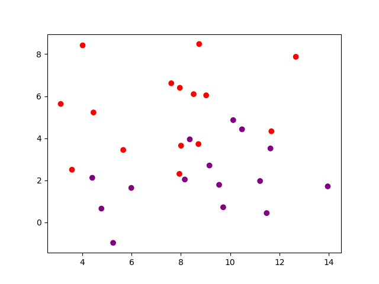
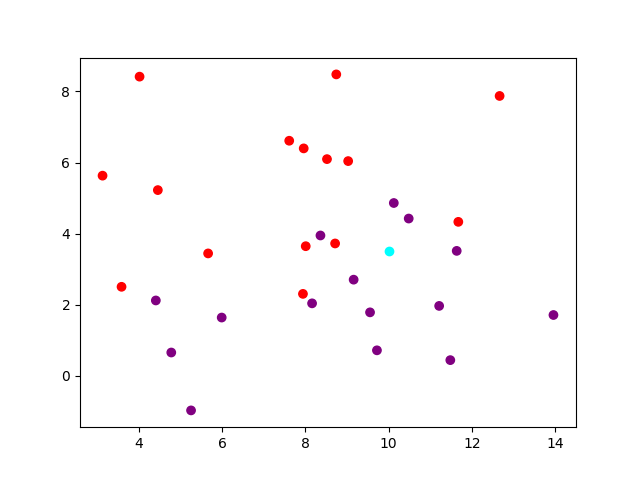

# 🏘️ MNIST K-Nearest Neighbors

This repository contains a simple implementation of the K-Nearest Neighbors algorithm to classify the MNIST dataset.

> **Note**: The MNIST dataset is a dataset of 60,000 small square 28x28 pixel grayscale images of handwritten single digits between 0 and 9. The dataset also includes a test set of 10,000 images.

## 📋 Summary

### 1. [What is the KNN algorithm and how it works](#1---what-is-the-knn-algorithm-and-how-it-works)

### 2. [Classification used](#2---classification-used)

### 3. [Accuracy](#3---accuracy)

### 4. [Credits](#4---credits)

## 1 - What is the KNN algorithm and how it works

The K-Nearest Neighbors algorithm is a simple algorithm that stores all available cases and classifies new cases based on a similarity measure (e.g., distance functions).

The KNN algorithm assumes that similar things exist in close proximity. In other words, similar things are near to each other.

For example, let's create a simple dataset with just two classes (red and purple). The dataset is shown in the following figure:

  

Now, suppose you have a new data point that is marked by the color cyan. You need to classify this data point into either the red class or the purple class.

  

Here's where the KNN algorithm comes in. It calculates the distance between the new data point and all the other data points to find the K nearest neighbors. The KNN algorithm classifies the new data point into the class to which the majority of the K data points belong.

For example, if we use K = 5, we will have [purple, purple, red, purple, purple]. Therefore, the new data point will be classified as purple.

> **Note**: The KNN algorithm is based on feature similarity. Choosing the right value of K is important for better accuracy. The lower the value of K, the more likely the classifier will overfit the data. The higher the value of K, the more likely the classifier will underfit the data.
>
> Here the points are in a 2D space (x, y), so the disance is calculated using the Pythagorean theorem. In a higher dimension, the distance is calculated using the Euclidean distance.

## 2 - Classification used

The question now is how to convert an image of the MNIST dataset into a point in a n-dimensional space ? There is no one answer to this question, but my goal was to achieve the best accuracy by simulate light. By that, I mean that the only thing that I could do in the image is throwing a ray of light from a certain source (top, bottom, left, right) and see where it stops.

At the beginning, I've tried to calcule the percentage of pixels that was crossed by the ray of light and the percetage of pixels hidden by the digits in each direction. The accuracy was fair enough (65%) but I wanted at least 80% of accuracy.

So I completely changed my approach. Instead, I've tried to get the variation relative and absolute of each side of the digit. Meanning that for each side, I throw a ray of light and when it encounters a pixel of the digit, it records the position of that pixel. By doing this sequentially for each "ray" along the specified side (e.g., top, bottom, left, or right), I can track how the position of the first detected pixel changes.

The absolute variation calculates the sum of the absolute differences between consecutive detected positions, providing a measure of how irregular the edge of the digit is along that side.

The relative variation keeps track of the signed differences between consecutive positions. This can help distinguish whether the shape along the side tends to grow outward or inward as we progress along the rays.

Finally, I also calculate the difference between the starting and ending position of the edge (end - start), which gives a sense of the overall "tilt" or "shift" of the edge.

## 3 - Accuracy

The accuracy of the KNN algorithm is calculated by dividing the number of correct predictions by the total number of predictions.

|  K  |                         Method                         | Accuracy |
| :-: | :----------------------------------------------------: | :------: |
|  5  |                    Light and shadow                    |  ~ 65%   |
|  5  |      Variation absolute & difference start - end       |  ~ 85%   |
|  5  | Variation absolute + relative & difference start - end |  ~ 87%   |

## 4 - Credits

- **[Original video](https://www.youtube.com/watch?v=CC4G_xKK2g8)**: The video that inspired me to create this project.
